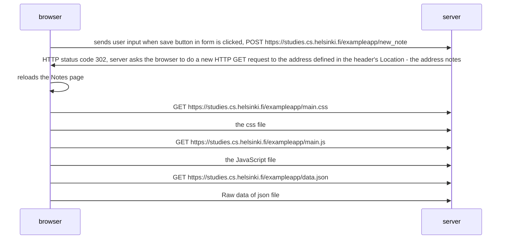

```mermaid
sequenceDiagram
    participant browser
    participant server
    browser->>server: sends user input when save button in form is clicked, POST https://studies.cs.helsinki.fi/exampleapp/new_note
    server->>browser: HTTP status code 302, server asks the browser to do a new HTTP GET request to the address defined in the header's Location - the address notes
    browser->>browser: reloads the Notes page
    browser->>server: GET https://studies.cs.helsinki.fi/exampleapp/main.css
    browser->>server: the css file
    browser->>server: GET https://studies.cs.helsinki.fi/exampleapp/main.js
    browser->>server: the JavaScript file
    browser->>server: GET https://studies.cs.helsinki.fi/exampleapp/data.json
    browser->>server: Raw data of json file
```
