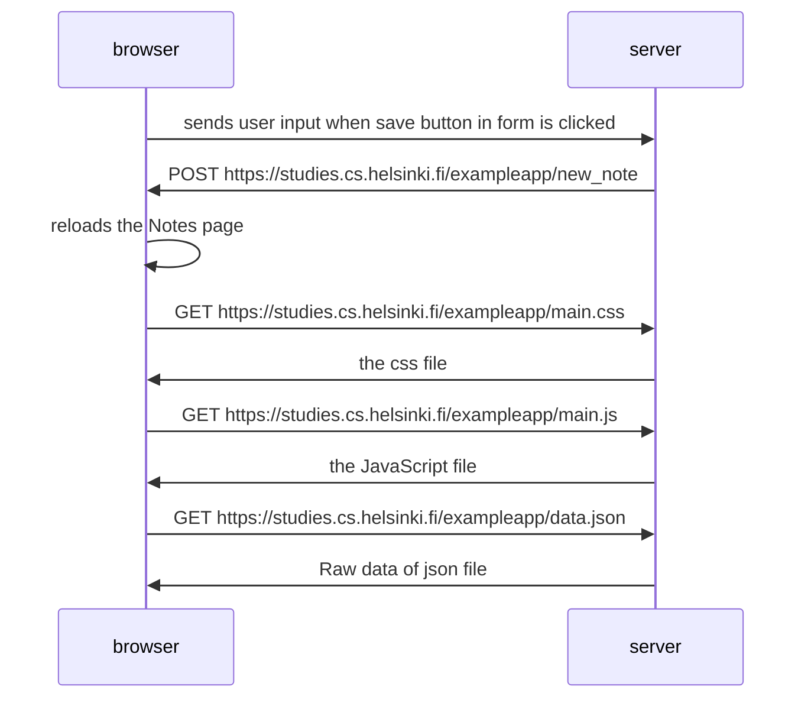

Exercise 0.4

```mermaid
sequenceDiagram
    participant browser
    participant server
    browser->>server: sends user input when save button in form is clicked
    server->>browser: POST https://studies.cs.helsinki.fi/exampleapp/new_note
    browser->>browser: reloads the Notes page
    browser->>server: GET https://studies.cs.helsinki.fi/exampleapp/main.css
    server->>browser: the css file
    browser->>server: GET https://studies.cs.helsinki.fi/exampleapp/main.js
    server->>browser: the JavaScript file
    browser->>server: GET https://studies.cs.helsinki.fi/exampleapp/data.json
    server->>browser: Raw data of json file
```
